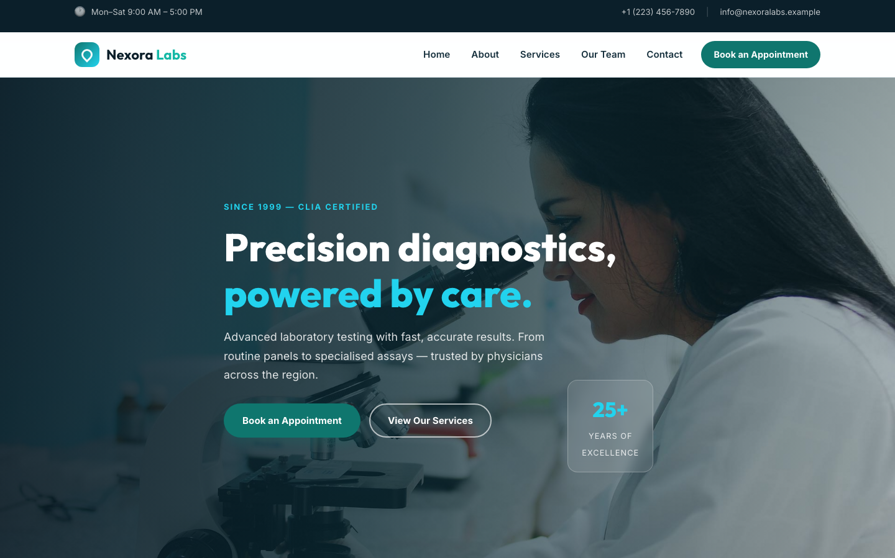

# Nexora Labs — Precision Diagnostic Laboratory Template

A premium, framework-free HTML template for a diagnostic laboratory. Deep teal and cyan on clean slate, driven by Outfit display type and Inter body text — a modern, authoritative presence for a clinical laboratory serving healthcare providers and patients.

## 📸 Screenshot

## Design System

| Token | Value |
|-------|-------|
| **Ground** | `--clr-ink` `#0b1f2a` (slate), `--clr-paper` `#f6fafc` |
| **Primary** | `--clr-teal` `#0f766e`, `--clr-teal-bright` `#14b8a6` |
| **Accent** | `--clr-cyan` `#22d3ee`, `--clr-cyan-soft` `#cffafe` |
| **Surface** | `--clr-card` `#ffffff`, `--clr-mist` `#eef5f8`, `--clr-line` `#dbe7ec` |
| **Text** | `--clr-ink` `#0b1f2a`, `--clr-text` `#3f5562`, `--clr-muted` `#6b8494` |
| **Display type** | `Outfit` (400–800) |
| **Body type** | `Inter` (400–800) |
| **Container** | 1200px max-width, centered |
| **Radius** | 14px |
| **Breakpoints** | ~992px, ~768px, ~576px |

## Pages

| Page | File | Description |
|------|------|-------------|
| Home | [index.html](index.html) | Crossfading hero, services ribbon, about split, stats band, four service cards, how-it-works steps, testimonial, CTA |
| About | [about.html](about.html) | Lab story since 1999, check-list quality, stats band, three values |
| Services | [services.html](services.html) | Four discipline cards, three specialised panels, turnaround stats |
| Our Team | [team.html](team.html) | Four expert cards, team stats band |
| Contact | [contact.html](contact.html) | Info list, topic-select contact form, embedded map |
| 404 | [404.html](404.html) | On-brand error page with recovery links |

## Features

- **Framework-free** — pure HTML5, CSS3 (custom properties, Grid, Flexbox, `clamp()`), vanilla JavaScript
- **Clinical authority aesthetic** — teal + cyan + slate, Outfit headlines
- **Fluid responsive** — three breakpoints, no horizontal scroll on any viewport
- **Scroll reveal** — IntersectionObserver-powered `.reveal` animations (respects `prefers-reduced-motion`)
- **Mobile nav** — burger toggle with `aria-expanded` accessible pattern
- **Hero crossfade** — automatic 6s background image transition via `.hero-bg img` + `.active`
- **Ribbon strip** — four laboratory discipline highlights
- **About split** — photo with floating badge, check-list and CTA
- **Service cards** — icon, name, description, call-to-action link
- **Process steps** — three numbered steps with iconography
- **Stats band** — four data points on dark background
- **Team cards** — photography, name, role, social links
- **Testimonial** — full-width background image with overlay and quote
- **Value cards** — icon, heading, paragraph
- **Contact form** — topic select, validation feedback, `[data-form]` hook
- **Newsletter** — footer sign-up form with validation feedback
- **Original imagery** — laboratory and medical photography, no placeholders

## Tech Stack

- HTML5 + CSS3 (W3C-valid, semantic landmarks)
- Vanilla JavaScript (canonical IIFE build)
- Google Fonts (Outfit + Inter)
- SVG favicon (inline data: URI)
- OpenStreetMap embed (contact page)

## SEO

- Semantic HTML5 structure (`<header>`, `<nav>`, `<main>`, `<section>`, `<footer>`)
- Unique `<title>` and `<meta description>` per page
- `lang="en"` attribute, `charset="utf-8"`, viewport meta
- Alt text on all images

## License

Free for personal and commercial use. Attribution appreciated but not required.

---

## Let's Build Something Together 🚀

[Book a free consultation](https://tally.so/r/q4q1L9)